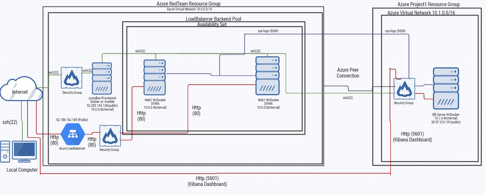
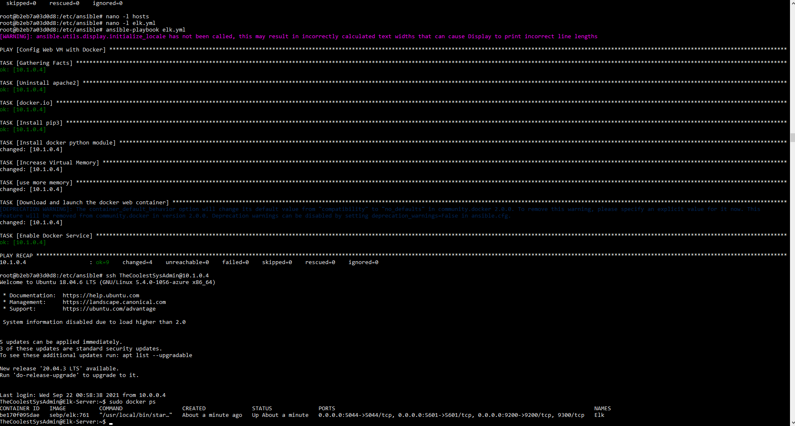

## Automated ELK Stack Deployment

The files in this repository were used to configure the network depicted below.



These files have been tested and used to generate a live ELK deployment on Azure. They can be used to either recreate the entire deployment pictured above. Alternatively, select portions of the playbook file may be used to install only certain pieces of it, such as Filebeat.


```
---
        - name: Config Web VM with Docker
          hosts: elk
          become: true
          tasks:
          - name: Uninstall apache2
            apt:
              name: apache2
              state: absent
          - name: docker.io
            apt:
              force_apt_get: yes
              update_cache: yes
              name: docker.io
              state: present
          - name: Install pip3
            apt:
              force_apt_get: yes
              name: python3-pip
              state: present
          - name: Install docker python module
            pip:
              name: docker
              state: present
          - name: Increase Virtual Memory
            command: sysctl -w vm.max_map_count=262144
          - name: use more memory
            sysctl:
              name: vm.max_map_count
              value: 262144
              state: present
              reload: yes
          - name: Download and launch the docker web container
            docker_container:
              name: Elk
              image: sebp/elk:761
              state: started
              restart_policy: always
              published_ports:
                - '5601:5601'
                - '9200:9200'
                - '5044:5044'
          - name: Enable Docker Service
            systemd:
              name: docker
              enabled: yes
-
```
```
---
- name: Installing and launch filebeat and metricbeats
  hosts: webservers
  become: yes
  tasks:
  - name: download filebeat deb
    command: curl -L -O https://artifacts.elastic.co/downloads/beats/filebeat/filebeat-7.6.1-amd64.deb
  - name: Install filebeat deb
    command: sudo dpkg -i filebeat-7.6.1-amd64.deb
  - name: drop in filebeat.yml
    copy:
      src: /etc/ansible/filebeat-config.yml
      dest: /etc/filebeat/filebeat.yml
  - name: enable and configure system module
    command: filebeat modules enable system
  - name: setup filebeat
    command: filebeat setup
  - name: start filebeat service
    command: service filebeat start
  - name: enable service filebeat on boot
    systemd:
      name: filebeat
      enabled: yes
  - name: download metricbeat
    command: curl -L -O https://artifacts.elastic.co/downloads/beats/metricbeat/metricbeat-7.6.1-amd64.deb
  - name: install metricbeat
    command: sudo dpkg -i metricbeat-7.6.1-amd64.deb
  - name: drop in metricbeat.yml
    copy:
      src: /etc/ansible/metricbeat-config.yml
      dest: /etc/metricbeat/metricbeat.yml
  - name: enable and configure docker module
    command: metricbeat modules enable docker
  - name: setup metricbeat
    command: metricbeat setup
  - name: start metricbeat
    command: metricbeat -e
  - name: enable service metricbeat on boot
    systemd:
      name: metricbeat
      enabled: yes
```

This document contains the following details:
- Description of the Topology
- Access Policies
- ELK Configuration
  - Beats in Use
  - Machines Being Monitored
- How to Use the Ansible Build


### Description of the Topology

The main purpose of this network is to expose a load-balanced and monitored instance of DVWA, the D*mn Vulnerable Web Application.

Load balancing ensures that the application will be highly available, in addition to restricting access to the network.
- The reason we are using an azure loadbalancer is because it is built into the network and easy to use! The loadbalancers protect the availabity of our DVWA site by splitting the load between web_1 and web_2 servers if one goes down or is too overloaded. The reason I am using a jumpbox is because it acts like a gateway. The jumpbox is the only server publicly exposed aside from web_1 and web_2 being behind a loadbalancer. You can only ssh to the local machines through the jumpbox once you have used your approved ssh key to ssh into that server.

Integrating an ELK server allows users to easily monitor the vulnerable VMs for changes to the files and system logs.
- Filebeats is a great tool that sends system logs to kibana. Kibana is a tool that makes it easy to visualize data as well as organizing that data.
- Metricbeat logs the metric data for your public facing servers. In our case metricbeat is logging metric data for docker containers and sending the data to kibana.

The configuration details of each machine may be found below.

| Name    | Function   | Ip Address:    | Operating System |
|---------|------------|----------------|------------------|
| Jumpbox | Gateway    | 52.255.143.126 | Ubuntu Server    |
| Web-1   | Web-Server | 10.0.0.9       | Ubuntu Server    |
| Web-2   | Web-Server | 10.0.0.8       | Ubuntu Server    |
| Elk     | Log Server | 10.1.0.4       | Ubuntu Server    |

### Access Policies

The machines on the internal network are not exposed to the public Internet. 

Only the Jumpbox machine can accept connections from the Internet. Access to this machine is only allowed from the following IP addresses:
- 71.126.238.25

Machines within the network can only be accessed by the jumpbox.
- Note: The elk machine only allows ssh connections through the jumpbox, however, to access the kibana dashboard is only able to be accessed through http on port 5601 through a whitelisted ip address.

A summary of the access policies in place can be found in the table below.
| Name    | Publicly Accessible | Whitelisted Ip Addresses |
|---------|---------------------|--------------------------|
| Jumpbox | Yes                 | 71.126.238.25            |
| Web-1   | No                  | 10.0.0.4                 |
| Web-2   | No                  | 10.0.0.4                 |
| Elk     | No                  | 10.0.0.4                 |

### Elk Configuration

Ansible was used to automate configuration of the ELK machine. No configuration was performed manually, which is advantageous because...
- It allows a big deployment of 10 to 15 machines to be done automatically. This also allows new machines being added to the network to be identical to the prior machines and this helps not cause any configuration errors. If any machines had to be reset it can be reconfigured in a matter of minutes and automatically.

The playbook implements the following tasks:
- The elk playbook first installs docker and updates cache.
- Then the playbook will proceed to install pip3 (python) to enable editing to docker containers and modules.
- The playbook will proceed to install the python docker module.
- Then the playbook will increase virtual memory as elk will have errors if it doesnt.
- Finalyl the playbook will download and initilize the elk container.

The following screenshot displays the result of running `docker ps` after successfully configuring the ELK instance.



### Target Machines & Beats
This ELK server is configured to monitor the following machines:
- Web-1
- Web-2

We have installed the following Beats on these machines:
- Filebeats 
- metricbeats 

These Beats allow us to collect the following information from each machine:
- Filebeats - This tool is used to log the syslog data from our machines such as when someone ssh's into the machine and edits files or configs.
- Metricbeats - This tool is used to log the metrics from our docker machines. This can be how much data a computer sent to the machine or how many visits the machine experinced in a day.

### Using the Playbook
In order to use the playbook, you will need to have an Ansible control node already configured. Assuming you have such a control node provisioned: 

SSH into the control node and follow the steps below:
- Copy the Elk-Config.yml file file to /etc/ansible/
- Update the hosts file to include your servers that you want to use the playbook on.
- Run the playbook, and navigate to http://(yourserversip):5601 to check that the installation worked as expected.

Answers
- Copy Filebeat_Config.yml to /etc/ansible/
- You want to update the hosts file to point to any machines you want elk to install on.
- http://(yourserversip):5601

- if you want to run the elk config file here is the command:
ansible-playbook Elk-Config.yml
